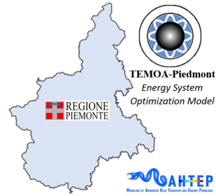
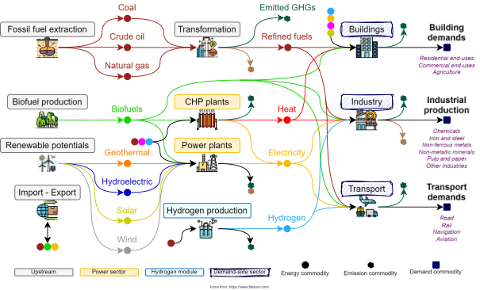

# TEMOA-Piedmont

## Model features

TEMOA-Piedmont is a model instance for the optimization of the Piedmont energy system developed within an [extended version](https://github.com/MAHTEP/TEMOA) of the [TEMOA](https://temoacloud.com/) (Tools for Energy Modeling Optimization and Analysis) modeling framework.

The model is maintained by the [MAHTEP Group](http://www.mahtep.polito.it) at [Department of Energy](https://www.denerg.polito.it/en/) of [Politecnico di Torino](https://www.polito.it/en). For any communication related to TEMOA-Italy, please write to [farzaneh.amirkavei@polito.it](mailto:farzaneh.amirkavei@polito.it).

The techno-economic modeling of new technologies in the TEMOA-Piedmont database mostly refers to the [TEMOA-Italy](https://github.com/MAHTEP/TEMOA-Italy/) model. A schematic representation of the modeled energy system is shown in Figure 1.

*Figure 1. Representation of the TEMOA-Piedmont energy system [4].*

## Contribution

The developing team wishes to receive help form the users in the definition and test of new test cases, in the benchmark against other established software, in the inclusion of other functionalities.
To contribute please refer to [contribution](CONTRIBUTION.md).

## Code of Conduct

The developing team agreed to embrace the  **Code of Conduct**.
 
## License
TEMOA-Italy is licensed under  or any other version of it.
