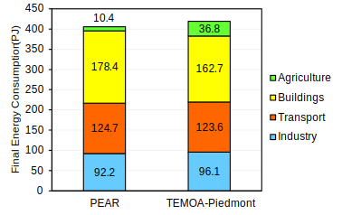

# **TEMOA-Piedmont**
TEMOA-Piedmont is a model instance for the optimization of the Piedmont energy system developed within an [extended version](https://github.com/MAHTEP/TEMOA) of the [TEMOA](https://temoacloud.com/) (Tools for Energy Modeling Optimization and Analysis) modeling framework.

The model is maintained by the [MAHTEP Group](http://www.mahtep.polito.it/) at [Department of Energy](https://www.denerg.polito.it/en/) of [Politecnico di Torino](https://www.polito.it/en). For any communication related to TEMOA-Italy, please contact [Farzaneh Amir Kavei, Matteo Nicoli and Laura Savoldi](mailto:farzaneh.amirkavei@unito.it;matteo.nicoli@polito.it;laura.savoldi@polito.it).

The TEMOA-Piedmont model is a long-term energy planning tool developed to analyze the energy system of the Piedmont region in Italy. Built from scratch within the open-source TEMOA framework, the model provides insights into the regional energy transition, considering the unique characteristics of Piedmont's energy supply and demand [1], [2].

## **Model Scope and Structure**
Touted as the first regional instance of Piedmont Region, Italy developed in TEMOA framework, TEMOA-Piedmont focuses on the regional energy landscape through a single spatial region and a time horizon from 2011 to 2050. This time horizon encompasses 15 milestone years, enabling the model to capture long-term dynamics while maintaining a degree of temporal granularity. The base year selection of 2011 was driven by the availability of high-quality census data, facilitating the calibration of the model with historical trends until 2021.

The model structure follows the traditional representation of an energy system, incorporating upstream, transformation, and demand sectors. The upstream sector includes processes for energy extraction, import, and renewable resource potentials. The transformation sector primarily concerns electricity generation, while the demand sectors represent final consumption in buildings, transport, and industry. A schematic of the energy system modeled in TEMOA-Piedmont is illustrated in Figure 1.

Figure 1. Representation of the TEMOA-Piedmont energy system.

## **Data Collection and Calibration**
Developing an energy system optimization model (ESOM) at the regional level required extensive data collection from multiple sources. The primary data sources include reports from the Italian National Transmission Operator (TERNA) for electricity and the National Mining Office for fossil fuel resources. Additional assumptions were necessary for disaggregating aggregate data into sector-specific components. For instance, gasoline consumption was entirely allocated to the transport sector, while jet kerosene was exclusively assigned to aviation. The model calibration was conducted using a hybrid bottom-up and top-down approach, ensuring alignment with historical energy balances. The comparison between the model-calculated final energy consumption mix for 2012 and the official regional statistics, shown in Figure 2, confirms the validity of the model outcomes [1], [2].

Figure 2. Final energy consumption mix in 2012 evaluated with TEMOA-Piedmont and by regional statistics.

## **Regional Focus and Sectoral Representation**
Tackling energy planning at a regional level allows the model to capture localized characteristics, which may be overlooked in national models. Piedmont, for example, benefits from significant hydroelectric resources due to its mountainous terrain. The model incorporates detailed renewable energy potentials, including solar and wind capacities, while geothermal resources are excluded due to their negligible presence in the region. Air quality regulations limit the deployment of solid biofuels in the residential sector, reflecting local policy measures.

The final energy demand is broken down into multiple subsectors for a comprehensive analysis. The building sector aggregates residential, commercial, and agricultural energy uses. In industry, the model differentiates processes based on energy intensity and fuel types. Transport demand is further disaggregated to distinguish between private, public, and freight transport.

## **Energy Trade and Policy Implications**
Piedmont's energy system traditionally relied on electricity imports until 2017, when regional self-sufficiency was achieved. In TEMOA-Piedmont, this historical shift is modeled through constraints that prohibit electricity imports from 2017 onward. Fossil fuel imports are represented through trade processes linked to national reference prices, as regional prices are assumed to follow national trends. The model also includes projected fuel prices that account for the spikes observed during the 2022 energy crisis.

## **Policy-Relevant Insights and Applications**
Tapping into the regional context, TEMOA-Piedmont supports policy-making by identifying potential barriers and opportunities for the energy transition. Its application to scenario analyses illustrates the impact of local pollution mitigation measures, the exploitation of hydroelectric resources, and the adoption of alternative fuels in the transport sector. The model outcomes align closely with regional energy planning documents, validating its utility as a decision-support tool.

In conclusion, TEMOA-Piedmont offers a versatile platform for exploring the energy transition of the Piedmont region. By leveraging open-access principles, the model fosters transparency and reproducibility in regional energy system modeling, while providing valuable insights to inform both regional and national energy policies.

## **References**
1. F. Amir Kavei, M. Nicoli, F. Quatraro, and L. Savoldi, “Enhancing energy transition with open-source regional energy system optimization models: TEMOA-Piedmont,” *Energy Convers Manag*, vol. 327, p. 119536, Mar. 2025, doi: 10.1016/J.ENCONMAN.2025.119536.
2. F. Amir Kavei, M. Nicoli, F. Quatraro, and L. Savoldi, “The Energy Transition in the Age of Open Science: Call for Regional Modelling Solutions,” *Energy Proceedings*, vol. 47, 2024, doi: 10.46855/energy-proceedings-11294.

## **Contribution**
The developing team wishes to receive help form the users in the definition and test of new test cases, in the benchmark against other established software, in the inclusion of other functionalities.
To contribute please refer to [contribution](CONTRIBUTION.md).

## **Code of Conduct**
The developing team agreed to embrace the  **Code of Conduct**.
 
## **License**
TEMOA-Italy is licensed under  or any other version of it.
